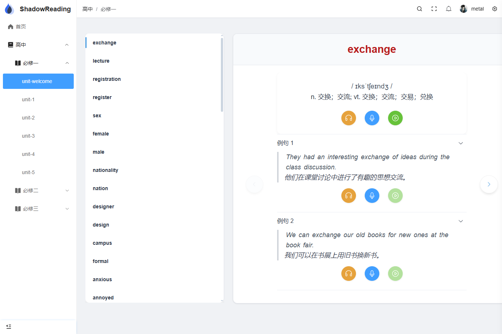

# Java-Whisper-ASR

[](https://license/)


## 📖 项目简介

### 背景

基于 [GiviMAD/whisper-jni](https://github.com/GiviMAD/whisper-jni) 二次开发，可以识别到单词级别的语音识别

项目集成人教版高中必修课本的单词、例句发音以及用户可以录入音频来对比发音情况（相关例句由AI生成）




### 后端引擎 (shadow-reading)

- **定制Whisper-JNI**：基于 [GiviMAD/whisper-jni](https://github.com/GiviMAD/whisper-jni) 二次开发，原项目不支持单词级别的语音识别
- **匹配算法**：动态算法来识别语音内容与句子匹配程度
### 前端页面 (pure-admin-thin)

## 🛠️系统要求

- Java版本：JDK 17+

- 操作系统： (目前在window10 和 Ubuntu 20.04.6 LTS 测试使用过)

  Windows10 x86_64 (included binary requires CPU features avx2, fma, f16c, avx)
  Linux GLIBC x86_64/arm64 (built with debian focal, GLIBC version 2.31)

## 🚀 快速开始
网盘下载：[Java-Whisper-ASR.zip](https://pan.baidu.com/s/1qTIwqeTjFP2HfTjdN7j7Vg) 提取码: dkfp
解压下载后的包，执行以下命令

```sh
java -jar application-2.0.0.jar --whisper.modelFile=./model/ggml-large-v3-turbo-q8_0.bin
```

## 📜 许可证

本项目采用 [Apache License 2.0](https://license/)
